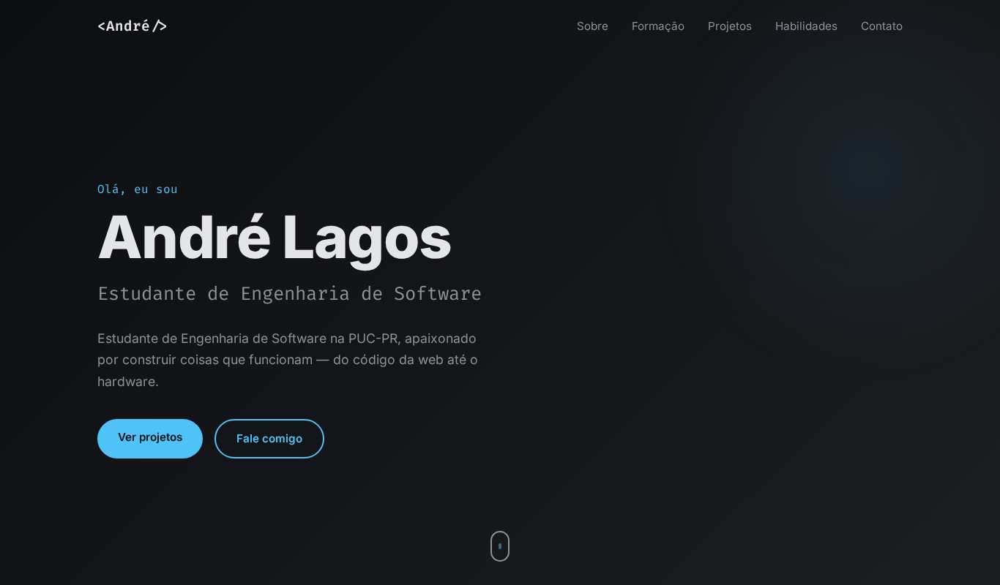

<div align="center">

# Portfólio — André Lagos

Meu site pessoal, feito do zero com **HTML, CSS e JavaScript puros** e publicado com **GitHub Pages**.

[](https://lakes777.github.io)




</div>

## Funcionalidades

- **Responsivo**: se adapta a computador, tablet e celular, com menu hambúrguer no mobile
- **Texto digitando** na apresentação
- **Animações ao rolar** a página, usando `IntersectionObserver`
- **Menu inteligente** que destaca a seção visível na tela
- **Copiar e-mail** com um clique
- **Acessível**: respeita a preferência de "reduzir movimento" do sistema e usa HTML semântico
- **Sem frameworks nem dependências**, só três arquivos

## Estrutura

```
├── index.html      # estrutura e conteúdo do site
├── css/
│   └── style.css   # estilos (cores ficam em variáveis no topo)
├── js/
│   └── main.js     # interatividade
└── assets/
    └── preview.png # imagem usada neste README
```

## Como rodar localmente

```bash
git clone https://github.com/Lakes777/Lakes777.github.io.git
cd Lakes777.github.io
```

Depois é só abrir o `index.html` no navegador. Não precisa instalar nada.

## Personalizando

As cores do site ficam em variáveis CSS no começo de `css/style.css`:

```css
:root {
  --bg: #0b1418;       /* fundo */
  --accent: #4fc3f7;   /* cor de destaque */
  ...
}
```

Troque os valores e o site inteiro muda junto.

## Créditos

Ícones do [Lucide](https://lucide.dev) (licença ISC) e logos do [Simple Icons](https://simpleicons.org) (CC0), embutidos como SVG e pintados com a cor de destaque do site.

## Contato

[](https://www.linkedin.com/in/andr%C3%A9-lagos-978a95355/)
[](https://mail.google.com/mail/?view=cm&fs=1&to=andreplagoscontato@gmail.com)
